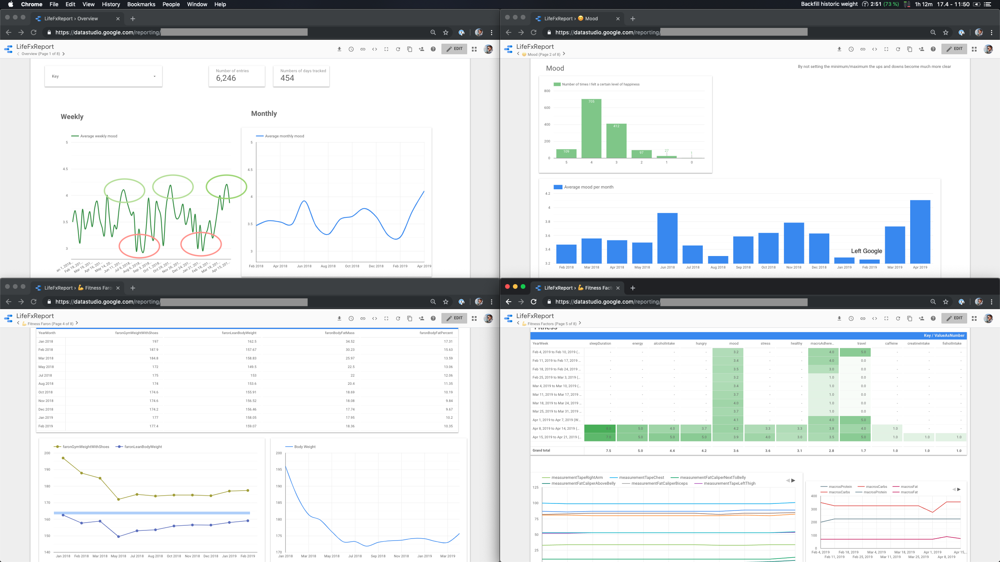
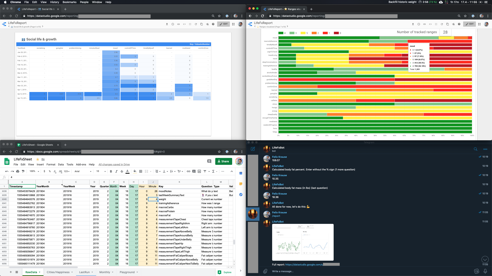
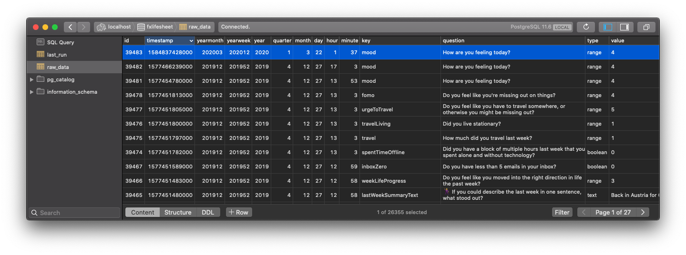
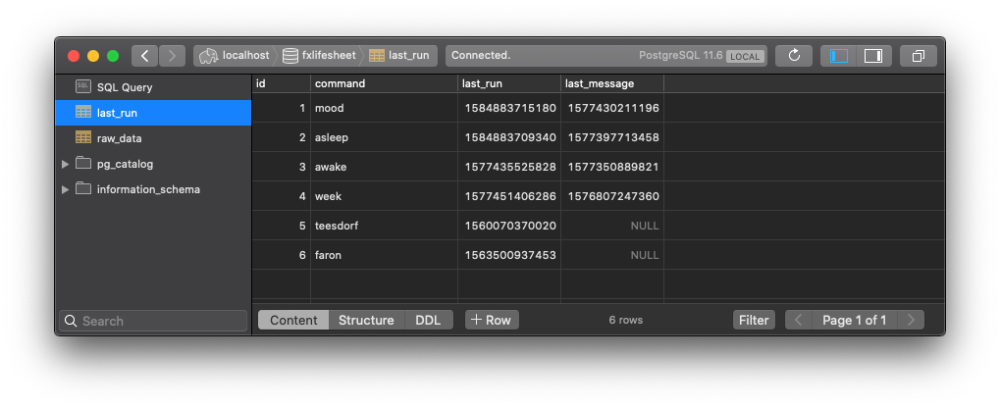

# FxLifeSheet

[](https://twitter.com/KrauseFx)




## Status of the project

This is still a Work-in-Progress project. I'm using this for myself already, and things are working well. However there are still missing pieces, in particular the dashboard is currently hard-coded in Google Data Studio. I'll work on [finding an alternative](https://github.com/KrauseFx/FxLifeSheet/issues/34).

## Goal

To track all my relevant quantified data in a central place, in which I fully own the data

### Sub goals

As every person is so vastly different, and cares about different metrics in their life, this solution has to be highly customizable.

- Fully own the data in a usable format
- Easily add/remove data I track at any time
- Generate useful reports
- Keep myself accountable
- Focus on fitness, overall well-being, and self-improvements
- Easy input, that make it "fun" to track the data
- Clear separation between data input and analyzing data, as one has to work day to day while on-the-go, the other one requires a full desktop

### Questions to answer

There are many questions that can be answered using this data, here are some main ones I want to look into over the next few months

#### Mood/Happines related:

- How does the city I'm in influence my level of happiness?
- How does the weather/climate influence my mood
- How does travel affect my mood?
- How do certain macro nutrition goals affect my mood?
- What amount of hours of sleep have the best influence on mood?

#### Fitness related

- How do certain macro goals influence my lean body mass and fat levels?
- How does my daily kcal intake affect my social life?
- How does alcohol affect my training and fitness progress?
- Do more daily steps influence
  - my mood
  - the amount of audio books I'm reading
  - feeling connected with family & friends as often calling them
- What are the areas in life that suffer while cutting (kcal deficit):
  - mood
  - stress
  - productivity
  - energy

#### Travel

- What are the areas in life that suffer when I travel? Investigate:
  - fitness progress
  - productivity
  - stress
  - health
  - sleep
  - feeling connected with friends

#### Productivity

- How many hours did I spend on my phone and laptop over the months?
- Do I stick to my yearly book goals and how do other factors influence how much I'm reading?
- Am I more productive when I set the goals for the day the night before?

## Implementation

**Assumptions**

- The user is in random time zones at random times and switches often, therefore the bot can't know about your daily schedule. This puts a lot of focus on averages, as it doesn't matter if a value was entered at 11pm that day, or 8am the next one, the numbers will even out, as only daily, weekly and monthly averages are considered when rendering graphs.

This repo contains a simple Telegram bot that has a limited amount of responsibilities.

There are 2 ways to input data: by the user telling the bot to ask for all the values, and by a regular interval of the bot asking you (similar to the [mood bot](https://github.com/krausefx/mood))

### Configuration

[`lifesheet.json`](./lifesheet.json)

Available values for `schedule`:

- `eightTimesADay`
- `daily`
- `weekly`
- `manual`


### User initiates data inputs 

#### Mood

Using `fourTimesADay`, this will replace the mood bot

- How are you feeling today?

#### Morning

`/awake`

This will trigger the morning questions, like:

- Sleep duration
- Sleep quality

#### Evening

`/asleep`

This will trigger the end-of-day questions like

- Fitness related:
  - Alcohol intake
  - Macro adherence
  - Hunger issues?
  - Fatigu/Lethargy?
  - Feel stressed?
  - Caffeine intake?
  - How healthy do you feel today?
  - Number of steps according to Apple Health
- Productivity related
  - Did I solve actual programming/technical problems?
- Social
  - Felt like enough time by myself?
  - Felt like enough in control of my own time and schedule?
  - Felt like enough socializing?
  - Felt like enough going out, bars, restaurants, dancing etc.
- Personal growth
  - Learned new skills or things?
  - Went out of my comfort zone?
  - Number of minutes of Audible
- Other
  - Meditated
  - Note: what was the main thing I did today?
  - Boolean: Did I set goals for the next day?
  - Do you feel excited about what's ahead in the future?

#### Week

`/week`

This will trigger questions that take longer to reply, so they're only done weekly

- Fitness related
  - Current macros
    - g of Carbs
    - g of Protein
    - g of Fat
  - Body measurements
    - Band
      - Chest (covers lats, eben gemessen, engaged)
      - Right Arm (engaged, lift up)
      - Left Arm (engaged, lift up)
      - 2" above (relaxed, 3 fingers above belly)
      - Belly
      - 2" below (relaxed, 3 fingers above belly)
      - Hip (right above, include butt in measurement)
      - Right Thigh (widest part of legs)
      - Left Thigh (widest part of legs)
    - Fat caliper
      - Fat caliper avg left/right biceps
      - Fat caliper right above belly button, von oben
      - Fat caliper avg right next to belly button, von oben
  - Current weight (weekly, as weight is measured in mfp anyway)
  - Overall training adherence
  - Note: Comments on fitness
- Productivity
  - Overall happiness with life progress of the week, do I go into the right direction?
  - Number of open Trello tasks (from [whereisfelix.today](https://whereisfelix.today))
  - Number of emails in Inbox less than 5?
  - Average daily hours on computer
  - Average daily iOS screen time (minus MyFitnessPal and Strong app)
- Social
  - Felt like spent enough time with family?
  - Had deep conversations with close friends?
- Other
  - Did I travel, this includes every city more than 1h away, this is relevant for both fitness and productivity
  - Note of all locations I was at (cities)
  - Got out of my comfort zone & experienced/tried new things?
  - Do you feel like having to travel somewhere?
  - Do you feel like you're missing out on things?
  - Played computer games by myself
  - Played computer games with friends or family?

### Reminders

There should be something built-in to remind the user to run the `/week` and the other commands if they didn't in a given time.

e.g. if a `/sleeping` task is defined to be `/daily`, it would remind the user 25h after the previous entry. The user may then choose to ignore it or run the command whenever the want. The key is that the user always has to manually trigger the inputs, as we never want to ask them at a wrong time, or have an overlap of multiple "surveys"

## Ideas

- For each question, add replies depending on the response, similar to what the [mood bot](https://github.com/krausefx/mood) is already doing, e.g.
  - Question "Do you feel like you're missing out on things?", user replies with "Yes, feeling sad", bot replies with "Okay, now think about 3 actions you can take to solve this, and implemnent at least one"

## Telegram

### Insert for available commands

```
skip - Skip a question that was asked
report - Generate one page report
track - Track a specific value only
mood - Track your mood
awake - First thing in the morning
asleep - Right before going to sleep
week - Once per week metrics
skip_all - Remove all queued questions
```

## Development

### Running locally

```
npm run dev
```

### Debugging

After using `npm run dev`, open [chrome://inspect](chrome://inspect) to use the Chrome Dev Tools


### Setup

### Environment variables

`.keys` file or however you manage your secret env variables:

```
export TELEGRAM_BOT_TOKEN=""
export TELEGRAM_USER_ID=""
export TELEGRAM_CHAT_ID=""

export DATABASE_URL=""

export LIFESHEET_JSON_URL=""

export OPEN_CAGE_API_KEY=""
export WEATHER_API_KEY=""
```

### Scheduler

Use the Heroku scheduler, and set it to run every hour to remind you to run certain commands according to the defined schedule (`weekly`, etc)

```
npm run reminder
```

### Postgres

Create a new Postgres database, and run the SQL queries defined in [importers/google-sheets-db/create_tables.sql](importers/google-sheets-db/create_tables.sql)





### Google Data Studio

Right now, you'll need to setup Google Data studio to visualize your data. I created a [public report](https://datastudio.google.com/open/1xNRbyt_JicmYRw8DOB8DBuabaUyDhIAk) you can copy and connect with your data source. As data source, you'll need to select your Google Sheet and select `RawData` as the Sheet to use.

The goal is to move away from Google Data Studio, see https://github.com/KrauseFx/FxLifeSheet/issues/34.
